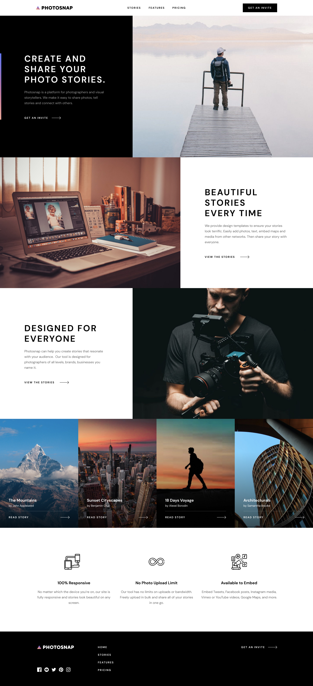

# Photosnap Website Challenge

Our team challenged ourselves to build this beautifull design in the techniques you are comfortable with.

## What I used

- Vue.js
- Nuxt.js
- Tailwind CSS

It is hosted on Vercel: [CHECK RESULT](https://photosnap.byrayray.dev)

## What I changed?

- This design was created for light-mode, so I added a dark-mode view during the implementation.
- The design wasn't designed for checking on a 4K monitor, so I added my own creativity and implemented a better view on big monitors as well.



# Want to run this project?

Follow the instructions below 👇

## Setup

Make sure to install the dependencies:

```bash
# npm
npm install

# pnpm
pnpm install

# yarn
yarn install

# bun
bun install
```

## Development Server

Start the development server on `http://localhost:3000`:

```bash
# npm
npm run dev

# pnpm
pnpm run dev

# yarn
yarn dev

# bun
bun run dev
```

## Production

Build the application for production:

```bash
# npm
npm run build

# pnpm
pnpm run build

# yarn
yarn build

# bun
bun run build
```

Locally preview production build:

```bash
# npm
npm run preview

# pnpm
pnpm run preview

# yarn
yarn preview

# bun
bun run preview
```

Check out the [deployment documentation](https://nuxt.com/docs/getting-started/deployment) for more information.
